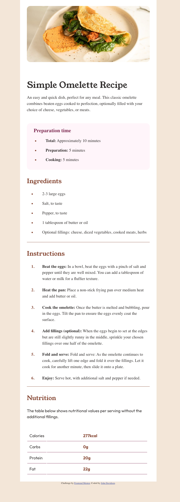
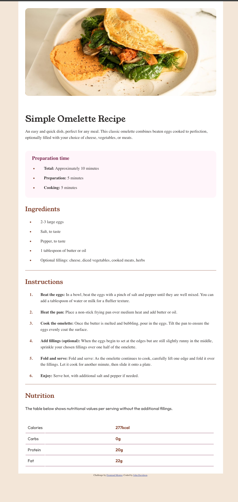

# Frontend Mentor - Recipe page solution

This is a solution to the [Recipe page challenge on Frontend Mentor](https://www.frontendmentor.io/challenges/recipe-page-KiTsR8QQKm). Frontend Mentor challenges help you improve your coding skills by building realistic projects.

## Table of contents

- [Overview](#overview)
  - [The challenge](#the-challenge)
  - [Screenshot](#screenshot)
  - [Links](#links)
- [My process](#my-process)
  - [Built with](#built-with)
  - [What I learned](#what-i-learned)
  - [Continued development](#continued-development)
  - [Useful resources](#useful-resources)
- [Author](#author)
- [Acknowledgments](#acknowledgments)

## Overview

### Screenshot




### Links

- [Check out the code here](https://github.com/John-Davidson-8/fem-recipe-page-main)
- [Check out the site here](https://fem-recipe-page-main.netlify.app/)

## My process

I began mobile first giving the body a flex direction of column. I set the media query for desktop at 30rem. There was not much in the way of difference between the mobile version and desktop version. Apart from a border radius on the header image.

### Built with

- Semantic HTML5 markup
- CSS custom properties
- Flexbox

### What I learned

I enjoyed this project as it afforded me practice with both ordered lists and unordered lists. I also had practice in using inline span classes.

Below is a code snippet of html which highlights the span classes used in an unordered list.

```html
<div class="prepTime">
  <h3>Preparation time</h3>
  <ul>
    <li><strong>Total:</strong> Approximately 10 minutes</li>
    <li><strong>Preparation:</strong> 5 minutes</li>
    <li><strong>Cooking:</strong> 5 minutes</li>
  </ul>
</div>
```

Below is css code snippet on how to style list markers

```css
li::marker {
  color: var(--clr-primary-1-nutmeg);
  font-weight: 700;
}
```

### Continued development

As I learn Javascript I have realized that I have to continue to build html and css projects at the same time, as I do not want to forget what I have learned over the last 18 months.

## Acknowledgments

Once again I thank the Frontend Mentor community for all their help.
